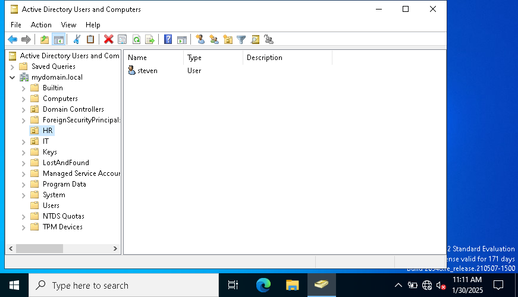

# How to Enable a Disabled Account in Active Directory

When a user account is disabled, they will see an error message upon login:  
_"Your account has been disabled. Please see your system administrator."_

This guide shows how to re-enable the account using Active Directory.

## **Step 1: Identify the Issue**
- The user reports that they cannot log in.
- The login screen displays:  
  

## **Step 2: Open Active Directory Users and Computers (ADUC)**
1. Log in to the **domain controller** or an admin workstation.
2. Open **Active Directory Users and Computers** (dsa.msc).
3. Navigate to **Users** or the relevant **OU** where the user is stored.
4. Locate the user account.  
   

## **Step 3: Enable the User Account**
1. Right-click the disabled account.
2. Select **Enable Account**.  
   
3. The user should now be able to log in.

## **Additional Notes**
- If the account remains disabled, check **Group Policies** and **Security Logs**.
- If the password is unknown, perform a **password reset**.